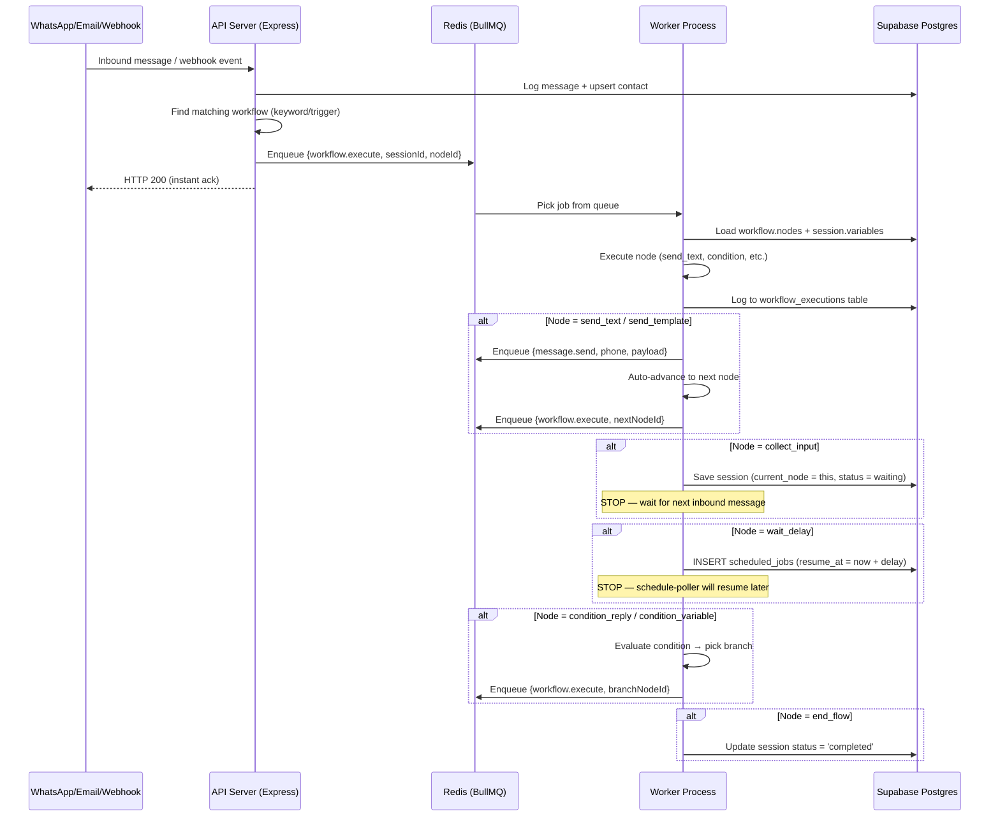

# 🔍 Frequency — MVP Audit & Roadmap (v3)

> **Core thesis:** Multi-channel automation engine — WhatsApp, Email (Gmail), Webhooks, Google Sheets/Drive, external APIs, or any trigger → workflow executes → automated actions fire across any connected channel — running 24/7/365.
>
> WhatsApp is the first channel, not the only one. The engine must be channel-agnostic.

---

## 📋 Module-by-Module Scorecard

| Module | % | What's Built | What's Missing to reach 100% |
|---|---|---|---|
| **Auth & Onboarding** | **90%** | Supabase Auth, FB Embedded Signup, Google OAuth, step wizard | Password reset flow, email verification reminder, session refresh edge cases |
| **WhatsApp Connect** | **85%** | Token exchange, long-lived token, WABA subscribe, phone display | Token refresh cron (60-day expiry), disconnect/reconnect flow, multi-number support |
| **Google OAuth** | **80%** | OAuth flow, encrypt/decrypt tokens, auto-refresh on expiry | Revoke/disconnect UI, scope upgrade flow, token health monitoring |
| **Dashboard** | **80%** | Live metrics, 7-day chart, recent broadcasts/workflows/convos | Real-time WebSocket updates, conversion funnel, revenue tracking, date range picker |
| **Leads (CRM)** | **75%** | Tables, columns, rows, CSV/Sheets import, assignment rules, field mappings | Kanban view, lead scoring, duplicate detection, merge, activity timeline per lead |
| **Inbox** | **70%** | Realtime chat, bot pause, tags, notes, assignment, message bubbles | Media messages (image/video/doc display), canned responses, typing indicators, tenant-scoped contact queries |
| **Multi-Tenant RBAC** | **70%** | 3-tier roles, entitlements, permissions middleware, team invite | Some routes still use `user_id` not `tenant_id`, no permission UI for custom roles, no audit log |
| **Webhook Handler** | **65%** | Receives WhatsApp messages, triggers keyword workflows, status updates | No queue — runs inline, no retry on failure, contacts upserted with `user_id` instead of `tenant_id` |
| **Contacts** | **60%** | CRUD, search, tags, phone-based dedup | `user_id` vs `tenant_id` mismatch on upsert, no merge duplicates, no import from CSV, no activity log |
| **Workflow Builder** | **55%** | Claude streaming, clarifying questions, skill matching, node preview | Saved JSON missing `config`/`connections`, no visual editor (React Flow), no test/simulate mode |
| **Broadcasts** | **50%** | CRUD, audience by tags, send loop, status tracking | No template params `{{1}}`, no scheduling (field exists but ignored), fire-and-forget send loop, no per-contact analytics |
| **Admin Panel** | **50%** | Tenant list, platform stats, feature toggles | No billing/plans, no usage metering, no tenant impersonation, no queue monitoring |
| **WA Templates** | **40%** | Create via Meta API, local DB storage, rich preview UI | No status sync (approved/rejected never updates), no edit/resubmit, no variable preview, reads from DB not Meta |
| **Settings** | **40%** | Page structure, integration cards, team section | No token management UI, no webhook URL display, no API key management, incomplete integration status |
| **Workflow Engine** | **35%** | `send_text`, `send_template`, `send_interactive`, `collect_input`, `update_sheet`, `calendar` nodes work | `wait_delay` is no-op, no auto-advance between nodes, 7+ node types unimplemented, no execution logging, runs inline not queued |
| **Campaigns** | **15%** | CRUD for campaign metadata, UI list/create | Zero execution — no drip steps, no enrollment, no scheduling, no step-by-step delivery |
| **Analytics** | **10%** | Page component exists with chart placeholders | No backend endpoints, no data aggregation, 100% mock/empty data |

---

## 🏗️ Execution Engine — Deep Technical Architecture

### Tech Stack

| Layer | Technology | Why This Choice |
|---|---|---|
| **Job Queue** | [BullMQ](https://docs.bullmq.io/) (`bullmq` npm) | Production-grade, Redis-backed, supports delayed jobs, retries, rate limiting, flow dependencies, repeatable jobs. Used by n8n in queue mode. |
| **Message Broker** | [Redis](https://redis.io/) via `ioredis` npm | BullMQ requires Redis. Use **Upstash Redis** (serverless, free tier: 10K commands/day) or **Railway Redis** addon. Config: `maxmemory-policy: noeviction`, AOF persistence enabled. |
| **Database** | **Supabase Postgres** (existing) | Source of truth for workflows, sessions, executions, scheduled jobs. Use `pg_cron` extension for DB-level recurring tasks. |
| **Realtime** | **Supabase Realtime** (existing) | Push execution status updates to frontend without polling. Already used for inbox messages. |
| **Validation** | `zod` npm | Runtime schema validation on all API inputs and job payloads. |
| **Queue Dashboard** | `@bull-board/express` + `@bull-board/api` npm | Visual monitoring of all queues at `/admin/queues` — job counts, failed jobs, processing rates. |
| **HTTP Client** | Native `fetch` (Node 18+) | For Meta Graph API, Google APIs, external webhooks. No extra dependency needed. |
| **AI** | `@anthropic-ai/sdk` (existing) | For `run_ai_responder` node type — Claude generates context-aware replies. |
| **Scheduling** | BullMQ repeatable jobs + `scheduled_jobs` DB table | Repeatable: poller runs every 30s. DB table: persistent scheduled jobs survive restarts. |
| **Encryption** | Node `crypto` (existing) | AES-256-CBC for Google tokens. Must set proper `GOOGLE_TOKEN_SECRET` in prod. |

### Queue Architecture

```
┌─────────────────────────────────────────────────────────────┐
│                    REDIS (Upstash/Railway)                   │
│                                                             │
│  Queue: workflow.execute    ← webhook, API, schedule-poller │
│    concurrency: 10          (each job = 1 node execution)   │
│    retries: 3, backoff: exponential                         │
│                                                             │
│  Queue: message.send        ← workflow-executor, broadcasts │
│    concurrency: 5           (Meta rate limit: 80 msg/s)     │
│    retries: 5, backoff: exponential                         │
│    rate limit: 50/sec per tenant (limiter group by tenantId)│
│                                                             │
│  Queue: broadcast.batch     ← broadcast API endpoint        │
│    concurrency: 3           (each job = 1 broadcast)        │
│    child jobs → message.send per contact                    │
│                                                             │
│  Queue: system.cron         ← repeatable every 30s          │
│    concurrency: 1           (polls scheduled_jobs table)    │
│    single-instance lock (no duplicates across workers)      │
└─────────────────────────────────────────────────────────────┘
```

### How a Workflow Executes (Step by Step)



### Workflow Chaining (Workflow → triggers another Workflow)

This is how you connect one workflow's output as another workflow's input:

```
┌──────────────────┐     ┌──────────────────┐     ┌──────────────────┐
│  Workflow A       │     │  Workflow B       │     │  Workflow C       │
│  "Lead Qualifier" │────▶│  "Drip Campaign"  │────▶│  "Review Request" │
│                   │     │                   │     │                   │
│  trigger: inbound │     │  trigger: sub_wf  │     │  trigger: sub_wf  │
│  ...              │     │  ...              │     │  ...              │
│  node: start_wf   │     │  node: start_wf   │     │  node: end_flow   │
│    workflow_id: B  │     │    workflow_id: C  │     │                   │
│    pass_variables  │     │    pass_variables  │     │                   │
└──────────────────┘     └──────────────────┘     └──────────────────┘
```

**Implementation:** New node type `start_workflow`:
```typescript
// engine/nodes/start-workflow.ts
case 'start_workflow': {
  const targetWorkflowId = node.config?.workflow_id
  const passVars = node.config?.pass_variables ?? {}

  // Create a NEW session for the target workflow
  const { data: newSession } = await supabase.from('workflow_sessions').insert({
    tenant_id: session.tenant_id,
    workflow_id: targetWorkflowId,
    contact_phone: session.contact_phone,
    variables: { ...passVars, ...session.variables }, // merge vars
    parent_session_id: session.id, // link back
    status: 'active',
  }).select().single()

  // Enqueue execution of target workflow's first node
  await workflowQueue.add('execute', {
    sessionId: newSession.id,
    nodeId: targetWorkflow.nodes[0].id,
  })
  break
}
```

### Caching Strategy

| What | Where | TTL | Why |
|---|---|---|---|
| Workflow definitions | Redis hash `wf:{id}` | 5 min | Avoid DB reads on every node execution |
| Tenant config (tokens, WABA ID) | Redis hash `tenant:{id}` | 2 min | Hot path for message sending |
| Google access tokens | Redis string `gtoken:{tenantId}` | Until `expiry - 60s` | Avoid decrypt + refresh check per call |
| Template list | Redis hash `templates:{tenantId}` | 15 min | Template status polling refreshes this |

```typescript
// Example: cached tenant lookup
async function getCachedTenant(tenantId: string): Promise<Tenant> {
  const cached = await redis.get(`tenant:${tenantId}`)
  if (cached) return JSON.parse(cached)

  const { data } = await supabase.from('tenants').select('*').eq('id', tenantId).single()
  await redis.setex(`tenant:${tenantId}`, 120, JSON.stringify(data)) // 2 min TTL
  return data
}
```

### Concurrency & Rate Limiting

| Resource | Limit | How Enforced |
|---|---|---|
| Meta Graph API (messages) | 80 msg/sec per WABA, 1000 unique contacts/24h for unverified | BullMQ `limiter: { max: 50, duration: 1000, groupKey: 'tenantId' }` |
| Workflow executor | 10 concurrent node executions | BullMQ `concurrency: 10` on worker |
| Broadcast batch | 3 concurrent broadcasts | BullMQ `concurrency: 3` |
| Schedule poller | 1 instance (singleton) | BullMQ repeatable + `removeOnComplete` |
| Google API calls | 300 req/min per user | In-code rate limit via `p-throttle` npm or manual delay |
| Claude API (AI responder) | Based on plan tier | Queue with `concurrency: 2` |

### Supabase-Specific Features Used

| Feature | Usage |
|---|---|
| **pg_cron** | Fallback scheduler: `SELECT cron.schedule('check-jobs', '*/1 * * * *', $$ SELECT net.http_post('https://your-api/api/internal/poll-jobs') $$)` — calls our API every minute as a safety net if the BullMQ poller is down |
| **Realtime** | Push `workflow_executions` INSERT events to frontend for live execution log |
| **RLS** | Tenant isolation at DB level — even if server has a bug, data can't leak cross-tenant |
| **Edge Functions** (future) | Could run lightweight webhook validators at edge for lower latency |
| **Storage** (future) | Store media files (images, PDFs, docs) sent/received via WhatsApp |

---

## 📋 Phase Roadmap

### Phase 1: 🔴 Execution Engine (2 weeks, ~41h)

| # | Task | Effort |
|---|---|---|
| 1.1 | Install `bullmq`, `ioredis`, `@bull-board/express`. Create `src/queue.ts` with 4 queue definitions. Setup Upstash Redis. | 4h |
| 1.2 | Build `src/workers/workflow-executor.ts` — pull from queue, load session, execute node, auto-advance, log to `workflow_executions` | 12h |
| 1.3 | Build `src/workers/message-sender.ts` — send WA/email messages with exponential backoff, 5 retries, DLQ | 6h |
| 1.4 | Build `src/workers/schedule-poller.ts` — repeatable job every 30s, query `scheduled_jobs` for due items, enqueue resumptions | 4h |
| 1.5 | Migration `009_execution_engine.sql` — `workflow_executions` + `scheduled_jobs` tables with indexes | 2h |
| 1.6 | Refactor webhook handler — enqueue to `workflow.execute` instead of inline execution. Fix tenant scoping on contact upsert. | 3h |
| 1.7 | Implement all missing node types: `add_tag`, `assign_agent`, `condition_variable`, `http_request`, `update_crm`, `run_ai_responder`, `send_email`, `start_workflow` | 8h |
| 1.8 | Fix workflow launch to persist full node data (`config`, `connections`) | 2h |

### Phase 2: 🟡 Production Reliability (1-2 weeks, ~32h)

| # | Task | Effort |
|---|---|---|
| 2.1 | Split `index.ts` into route modules (see file structure below) | 4h |
| 2.2 | Broadcast queue processing — each contact = one `message.send` job | 6h |
| 2.3 | Broadcast scheduling via `scheduled_jobs` table | 3h |
| 2.4 | Template status sync — repeatable BullMQ job polls Meta every 15min | 4h |
| 2.5 | Template param support in broadcasts — map contact fields to `{{1}}` | 3h |
| 2.6 | Dead letter queue + error logging to `workflow_executions` | 4h |
| 2.7 | Graceful shutdown — `worker.close()` on SIGTERM | 1h |
| 2.8 | Zod validation on all API routes | 6h |
| 2.9 | Production encryption key enforcement | 0.5h |

### Phase 3: 🟢 Campaigns, Analytics & Monitoring (2-3 weeks)

| # | Task | Effort |
|---|---|---|
| 3.1 | Drip campaign engine — steps + enrollment + scheduled execution | 12h |
| 3.2 | Campaign enrollment triggers (tag added, form submit, import) | 6h |
| 3.3 | Real analytics backend — aggregate messages + executions | 8h |
| 3.4 | Execution logs UI — per-node status, timing, errors | 6h |
| 3.5 | Contact activity timeline | 6h |
| 3.6 | Broadcast per-contact analytics | 4h |
| 3.7 | Bull Board dashboard at `/admin/queues` | 3h |

### Phase 4: 🔵 Scale & Polish (2 weeks)

| # | Task | Effort |
|---|---|---|
| 4.1 | React Flow visual workflow editor | 16h |
| 4.2 | Workflow test/simulate mode | 4h |
| 4.3 | Separate `worker.ts` entry point for horizontal scaling | 4h |
| 4.4 | Per-tenant rate limiter in BullMQ | 3h |
| 4.5 | Webhook retry queue | 2h |
| 4.6 | Mobile responsive inbox | 4h |

### Phase 5: 🟣 Growth Features

| # | Feature |
|---|---|
| 5.1 | Payment integration (Razorpay webhook + link generation) |
| 5.2 | AI Responder (Claude auto-reply with business context) |
| 5.3 | Custom webhook triggers for external systems |
| 5.4 | Email channel execution in workflow engine |
| 5.5 | Billing & plans tied to `tenant_entitlements` |
| 5.6 | Audit logs |

---

## 🏗️ Target Server File Structure

```
flowgpt-server/src/
├── index.ts                 # Express setup, mount routers, Bull Board
├── queue.ts                 # BullMQ queues + ioredis connection
├── cache.ts                 # Redis caching helpers (getCachedTenant, etc.)
├── worker.ts                # Worker entry point (runs separately from API)
│
├── routes/
│   ├── workflows.ts         # CRUD + launch
│   ├── broadcasts.ts        # CRUD + send (enqueues to broadcast.batch)
│   ├── contacts.ts          # CRUD + messages
│   ├── inbox.ts             # Send reply, bot pause
│   ├── webhooks.ts          # WhatsApp/external webhook → enqueue
│   ├── team.ts              # RBAC, invites, permissions
│   ├── integrations.ts      # Google, Razorpay
│   └── templates.ts         # WA template CRUD
│
├── workers/
│   ├── workflow-executor.ts # Executes nodes from workflow.execute queue
│   ├── message-sender.ts    # Sends messages from message.send queue
│   ├── schedule-poller.ts   # Polls scheduled_jobs every 30s
│   ├── broadcast-worker.ts  # Fans out broadcast → per-contact message jobs
│   └── template-sync.ts     # Polls Meta API for template status
│
├── engine/
│   ├── executor.ts          # Node dispatcher + auto-advance logic
│   ├── interpolator.ts      # {{variable}} resolution
│   └── nodes/
│       ├── send-text.ts
│       ├── send-template.ts
│       ├── send-interactive.ts
│       ├── collect-input.ts
│       ├── wait-delay.ts
│       ├── condition-reply.ts
│       ├── condition-variable.ts
│       ├── add-tag.ts
│       ├── assign-agent.ts
│       ├── http-request.ts
│       ├── update-crm.ts
│       ├── update-sheet.ts
│       ├── calendar-event.ts
│       ├── ai-responder.ts
│       ├── send-email.ts
│       ├── start-workflow.ts  # Chain workflows
│       └── end-flow.ts
│
├── google.ts                # Google API helpers (existing)
├── leads.ts                 # Tables router (existing)
└── admin.ts                 # Super admin router (existing)
```

---

## 🎯 Start Here

**Phase 1, tasks 1.1 → 1.5 → 1.2 → 1.6** in that order. Once those 4 are done, the core loop works end-to-end for the first time — any trigger → queued execution → auto-advancing nodes → delayed follow-ups → cross-channel actions.
