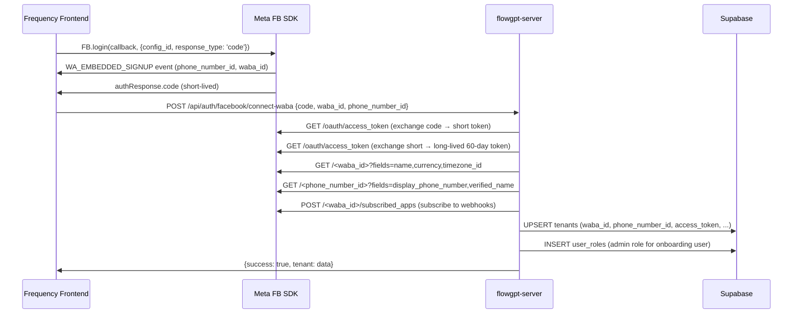

# 🤝 Frequency — Meta WhatsApp Tech Provider: Complete Technical Strategy (Updated)

> **Goal:** Get Frequency approved as an official Meta WhatsApp Tech Provider, onboard Arihant as the first production customer, and scale to a multi-tenant automation platform with native WhatsApp Flow support.

---

## 📊 Partner Tiers — Your Position

| | **Tech Provider** (YOU → HERE) | **Tech Partner** | **Solution Partner (BSP)** |
|---|---|---|---|
| **What it is** | SaaS company using WhatsApp Cloud API for multiple businesses | Tech Provider upgraded to Meta Business Partner | Full BSP with extended credit line from Meta |
| **Billing** | ❌ No credit line — customers pay Meta directly via their WABA | ❌ Same as TP | ✅ You pay Meta, then bill customers |
| **Revenue model** | SaaS subscription only | SaaS + partner perks | SaaS + API markup + services |
| **Key requirement** | App Review (2 videos) + Business Verification | TP + 10+ active customers + Meta Partner application | Meta Business Partner agreement (contracts, vetting) |
| **Embedded Signup** | ✅ Yes | ✅ Yes | ✅ Yes + custom flows |
| **Effort to achieve** | ⭐⭐ (1-2 weeks from current state) | ⭐⭐⭐ (3-6 months) | ⭐⭐⭐⭐⭐ (6-12 months) |

### Why Tech Provider is Right for You Now

1. **Arihant pays Meta directly** for per-conversation charges → zero billing risk for you
2. **No contracts** with Meta needed — just pass App Review
3. **SaaS subscription** revenue is simpler (₹1,499–5,999/mo per customer)
4. You can upgrade to Tech Partner once you have 10+ customers

---

## ✅ Codebase Audit — What Meta Requires vs What You Have

### Requirements Mapped to Exact Code

| # | Meta Requirement | Status | Your Code |
|---|---|---|---|
| 1 | Meta App with WhatsApp use case | ✅ | `META_APP_ID` in `.env`, used at [index.ts:42](file:///Users/nitinbagoriya/Desktop/flowgpt-server/src/index.ts#L42) |
| 2 | Connected Business Portfolio | ✅ | Linked during FB App Dashboard setup |
| 3 | Business Verification | ⚠️ **Verify** | Check: Meta Business Suite → Security Center → Business Verification |
| 4 | Embedded Signup (frontend) | ✅ | `OnboardingPage.tsx` — full 4-step wizard with FB SDK |
| 5 | Token exchange (code → short → long-lived) | ✅ | [index.ts:412-428](file:///Users/nitinbagoriya/Desktop/flowgpt-server/src/index.ts#L412-L428) — `fb_exchange_token` grant type |
| 6 | WABA info fetch | ✅ | [index.ts:430-442](file:///Users/nitinbagoriya/Desktop/flowgpt-server/src/index.ts#L430-L442) — fetches `name`, `currency`, `display_phone_number` |
| 7 | Webhook subscription (`subscribed_apps`) | ✅ | [index.ts:444-454](file:///Users/nitinbagoriya/Desktop/flowgpt-server/src/index.ts#L444-L454) — `POST /<WABA_ID>/subscribed_apps` |
| 8 | Tenant upsert (multi-tenant DB) | ✅ | [index.ts:457-466](file:///Users/nitinbagoriya/Desktop/flowgpt-server/src/index.ts#L457-L466) — upserts to `tenants` table |
| 9 | Webhook verification (GET) | ✅ | [index.ts:885-894](file:///Users/nitinbagoriya/Desktop/flowgpt-server/src/index.ts#L885-L894) — `hub.mode` + `hub.verify_token` |
| 10 | Inbound message handling (POST) | ✅ | [index.ts:898-946](file:///Users/nitinbagoriya/Desktop/flowgpt-server/src/index.ts#L898-L946) — routes by `waba_id` → tenant |
| 11 | Send messages via Cloud API | ✅ | `sendTextMessage()`, `sendTemplateMessage()`, `sendInteractiveMessage()` |
| 12 | Template management | ✅ | Create/list templates via Meta API, stored in `wa_templates` |
| 13 | Multi-tenant RBAC | ✅ | `tenants` + `user_roles` tables, `identifyTenant` middleware |
| 14 | App Review — `whatsapp_business_messaging` | ⛔ **NOT SUBMITTED** | Need Video 1 (message loop) |
| 15 | App Review — `whatsapp_business_management` | ⛔ **NOT SUBMITTED** | Need Video 2 (template creation) |
| 16 | Privacy Policy URL | ⚠️ **Create** | Must be publicly accessible at `Frequency/privacy` |
| 17 | Terms of Service URL | ⚠️ **Create** | Must be publicly accessible at `Frequency/terms` |

### Score Card

```
✅ Built:     13/17 requirements (76%)
⚠️ Verify/Create: 2/17 (Business Verification + Privacy/Terms URLs)
⛔ Missing:   2/17 (App Review video submissions)
🌊 Upcoming: WhatsApp Flows (Interactive Lead Gen)
```

---

## 🌊 WhatsApp Flows — The Interactive Powerhouse

WhatsApp Flows allow us to build rich, multi-screen interactive experiences (forms, surveys, booking flows) directly inside the WhatsApp app. For clients like Arihant, this replaces clunky external landing pages with 1-click lead capture.

### UI Features (Frequency Frontend)

| Component | Feature | Details |
|---|---|---|
| **Flow Builder** | JSON/Visual Editor | Create multi-screen Flow JSON with real-time validation against Meta's schema. |
| **Asset Manager** | Asset Uploads | Upload images/icons for flow headers via `POST /flows/{id}/assets`. |
| **Flow Previewer** | Mobile Simulator | Visual preview of screens, inputs (dropdowns, date pickers), and navigation logic. |
| **Template Linker** | CTA Integration | Attach a Flow to a Template button (type: `FLOW`) directly in the Template Builder. |
| **Analytics Dashboard** | Flow Funnel | Track: Sent → Opened → Screen 1 Dropoff → Completed. |

### Backend API Features (flowgpt-server)

| Endpoint | Method | Purpose |
|---|---|---|
| `/api/wa/flows` | `POST` | Create a new Flow on Meta's platform and store in `wa_flows`. |
| `/api/wa/flows/:id/assets` | `POST` | Handle multi-part upload of assets to Meta Cloud API. |
| `/api/wa/flows/:id/publish` | `POST` | Publish a Flow (once published, it cannot be edited/deleted). |
| `/webhook/wa/flows` | `POST` | **Flow Endpoint**: Decrypts JWE payloads, handles dynamic data requests, and returns encrypted responses. |
| `/api/wa/flows/responses` | `GET` | Export/view lead data captured via Flows. |

### Database Schema Requirements

```sql
-- WhatsApp Flows
CREATE TABLE IF NOT EXISTS public.wa_flows (
  id           UUID PRIMARY KEY DEFAULT gen_random_uuid(),
  tenant_id    UUID REFERENCES public.tenants(id) ON DELETE CASCADE,
  meta_flow_id TEXT UNIQUE, -- ID from Meta
  name         TEXT NOT NULL,
  status       TEXT CHECK (status IN ('DRAFT', 'PUBLISHED', 'DEPRECATED')),
  definition   JSONB, -- Flow JSON structure
  created_at   TIMESTAMPTZ DEFAULT NOW()
);

-- Flow Responses
CREATE TABLE IF NOT EXISTS public.wa_flow_responses (
  id           UUID PRIMARY KEY DEFAULT gen_random_uuid(),
  flow_id      UUID REFERENCES public.wa_flows(id) ON DELETE CASCADE,
  contact_id   UUID REFERENCES public.contacts(id),
  tenant_id    UUID REFERENCES public.tenants(id),
  screen_id    TEXT, -- Last screen reached
  response_data JSONB, -- The actual form data submitted
  created_at   TIMESTAMPTZ DEFAULT NOW()
);
```

---

## 🔑 BLOCKER #1: App Review — Exact Submission Guide

This is the **only technical gate** between you and Tech Provider status.

### Permission 1: `whatsapp_business_messaging`

**Grants:** Advanced access to send/receive messages on behalf of onboarded customer WABAs.

**Video 1 — Message Loop (must show):**

```
Recording Script:
1. Open Frequency → Navigate to Inbox or Broadcast page
2. Select a template → Send it to a test phone number
3. Switch to WhatsApp on the recipient phone → Show message received
4. Reply from the phone with text (e.g., "Interested in 2 BHK")
5. Switch back to Frequency → Show the reply appearing in the Inbox
6. (Bonus) Show the reply triggering a workflow step
```

> [!IMPORTANT]
> The video must clearly show:
> - Your app's UI (Frequency) sending the message
> - The WhatsApp client (mobile/web) receiving it
> - The user replying from WhatsApp
> - Your app receiving and displaying the reply

### Permission 2: `whatsapp_business_management`

**Grants:** Advanced access to manage customer WABAs, templates, and phone numbers.

**Video 2 — Template Management (must show):**

```
Recording Script:
1. Open Frequency → Navigate to WA Templates page
2. Click "Create Template"
3. Fill in: name, category (marketing/utility), language, body text
4. Add buttons or header if applicable
5. Submit the template
6. Show the template appearing in the templates list with "PENDING" status
```

---

## 🏗️ BLOCKER #2: Webhook Architecture for Multi-Tenant

### Current Architecture (What You Have)

```
Meta Cloud API
    │
    ▼
POST /webhook/whatsapp  ← Single endpoint for ALL tenants
    │
    ├── body.entry[].id = WABA_ID
    │
    └── Supabase lookup: tenants WHERE waba_id = entry.id
         └── Route to handleInboundMessage(tenant, msg)
```

**This works BUT** has a critical dependency: your app's webhook URL must be configured in the Meta App Dashboard → WhatsApp → Configuration → Callback URL. This is a **single URL per app** — all WABAs subscribed to your app will send events here.

---

## 🔌 Embedded Signup — Your Complete Flow

Your Embedded Signup implementation is **already functional**. Here's the exact flow:



---

## 🎯 Arihant — First Customer Onboarding Playbook

Arihant is your existing client. Here's the exact onboarding path:

### Current State
- Arihant has an existing WhatsApp Business account
- You've been using n8n + Wati for automation (conversations `f3b11b8f`, `12edf9d4`, etc.)
- Goal: Move Arihant from Wati to Frequency as the primary WhatsApp platform

### Step-by-Step

| # | Action | API / Code | Notes |
|---|---|---|---|
| 1 | Arihant clicks "Connect WhatsApp" in Frequency | `OnboardingPage.tsx` launches `FB.login()` | They log in with their Facebook account |
| 2 | They select their existing WABA + phone number | Meta Embedded Signup flow handles this | Their existing number migrates to your app |
| 3 | Token exchange happens automatically | [index.ts:405-466](file:///Users/nitinbagoriya/Desktop/flowgpt-server/src/index.ts#L405-L466) | Long-lived token stored in `tenants.access_token` |
| 4 | Webhook subscription activates | `POST /<WABA_ID>/subscribed_apps` | All Arihant's inbound messages now route to your webhook |
| 5 | Set up WhatsApp Flows | Frequency Flow Builder | Create a "Property Enquiry" flow for 2 BHK leads |
| 6 | Build workflows | Workflow builder → AI creates node graph | Replace n8n workflows with native Frequency automation |
| 7 | Go live | Activate workflows → messages flow through your platform | Monitor via Inbox page |

---

## 📋 3-Phase Action Plan

### Phase 0: Become Tech Provider (1-2 weeks)

| # | Task | Time | Status |
|---|---|---|---|
| 0.1 | **Verify business** — Meta Business Suite → Security Center | 1-3 days | ⚠️ Verify |
| 0.2 | **Create Privacy Policy** — Host at `Frequency/privacy` | 2h | ⛔ TODO |
| 0.3 | **Create Terms of Service** — Host at `Frequency/terms` | 2h | ⛔ TODO |
| 0.4 | **Record Videos** — Message loop + Template creation | 1h | ⛔ TODO |
| 0.5 | **Submit App Review** — Request permissions | 30min | ⛔ TODO |

### Phase 1: Production-Ready Engine (2-3 weeks)

| # | Task | Time | Priority |
|---|---|---|---|
| 1.1 | **BullMQ + Redis integration** — Background processing | 3 days | 🔴 Critical |
| 1.2 | **WhatsApp Flows API** — CRUD + Asset upload | 4 days | 🟡 Important |
| 1.3 | **Flow Endpoint Webhook** — JWE Encryption/Decryption | 3 days | 🔴 Critical |
| 1.4 | **Workflow execution engine hardening** | 1 week | 🔴 Critical |

### Phase 2: Go-to-Market (Month 2-3)

| # | Task |
|---|---|
| 2.1 | **Onboard Arihant** via Embedded Signup (replace Wati/n8n) |
| 2.2 | **WhatsApp Flows MVP** — Build Lead Capture Flow for 2 BHK site visits |
| 2.3 | **Landing page** at `Frequency` with feature showcase + pricing |
| 2.4 | **Case study** — Document Arihant's before/after (n8n+Wati → Frequency) |

---

## ⚡ Quick Reference: Key API Endpoints

| Endpoint | Purpose | Documentation |
|---|---|---|
| `POST /oauth/access_token` | Exchange code for access token | [Access Tokens](https://developers.facebook.com/docs/facebook-login/guides/access-tokens/get-long-lived) |
| `POST /<WABA_ID>/subscribed_apps` | Subscribe your app to WABA webhooks | [Subscribed Apps API](https://developers.facebook.com/documentation/business-messaging/whatsapp/reference/whatsapp-business-account/subscribed-apps-api) |
| `POST /<WABA_ID>/flows` | Create a WhatsApp Flow | [Flows API](https://developers.facebook.com/docs/whatsapp/flows/guides/implementing-your-first-flow) |
| `POST /<FLOW_ID>/assets` | Upload Flow Asset | [Flow Assets](https://developers.facebook.com/docs/whatsapp/flows/guides/managing-your-flows#assets) |
| `POST /<PHONE_ID>/messages` | Send a message | [Messages API](https://developers.facebook.com/documentation/business-messaging/whatsapp/reference/whatsapp-business-phone-number/message-api) |

---

## 🎯 Bottom Line

**3 things stand between you and being a live, revenue-generating Tech Provider:**

1. ⛔ **App Review** — Record 2 videos, submit, wait 3-7 days (~2h of your time)
2. ⛔ **Execution Engine** — BullMQ + Redis for 24/7 reliable automation (~2 weeks)
3. ⚠️ **WhatsApp Flows** — Implementing the Flow Endpoint for high-fidelity lead gen.

Everything else is **already built**. Ship the blockers and start onboarding Arihant.
